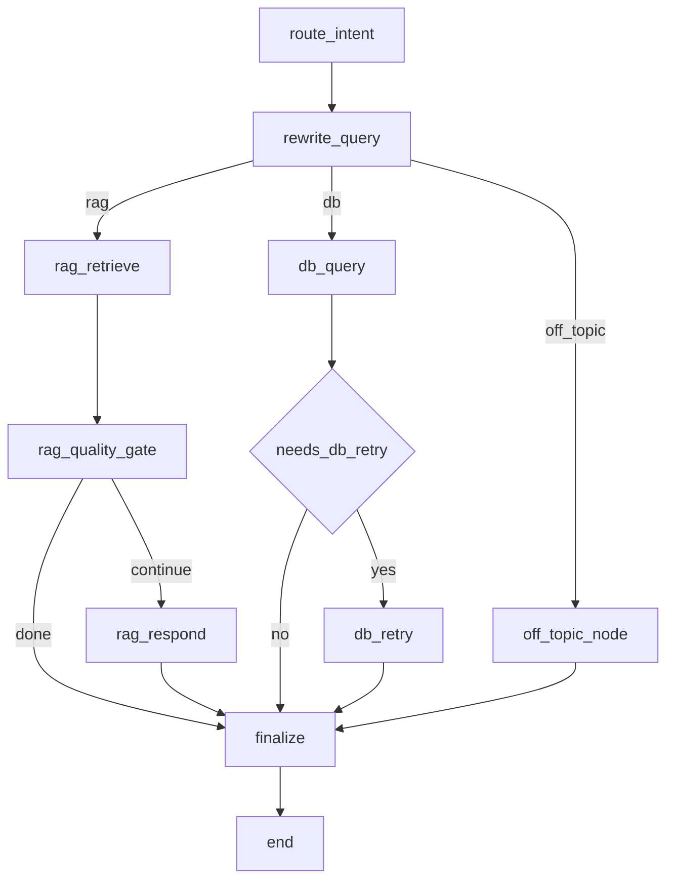

# Chatbot LangGraph Workflow (Phase 7)

This document captures the final Phase 7 chatbot orchestration architecture used when `CHAT_ENGINE=langgraph`.

## Why this exists

The previous chatbot flow was functionally correct but mostly linear. LangGraph adds explicit state transitions for reliability controls (quality gate, retry, and final contract validation) while preserving legacy fallback.

## Runtime switch

- `CHAT_ENGINE=legacy` -> uses `ChatService`
- `CHAT_ENGINE=langgraph` -> uses `LangGraphChatService`

## State graph

## Guardrails encoded in graph

1. **RAG quality gate**: if retrieval returns zero docs, return a deterministic no-context response instead of forcing an LLM narrative.
2. **DB retry node**: perform one bounded retry for known SQL generation/execution failure patterns.
3. **Finalize contract**: enforce reply payload shape before returning to API route.
4. **Global fallback**: if graph init/runtime fails, fallback to legacy `ChatService`.

## Operational observability points

- `/api/v1/chat` returns `engine` in response (`legacy` or `langgraph`).
- `/api/v1/chat/health` reports:
  - `chat_engine_configured`
  - `chat_engine_active`
  - `langgraph_available`

## Related files

- `backend/src/intelligence/langgraph_chat_service.py`
- `backend/src/api/chat_routes.py`
- `backend/tests/test_langgraph_chat_service.py`
- `backend/src/intelligence/chat_eval.py`
