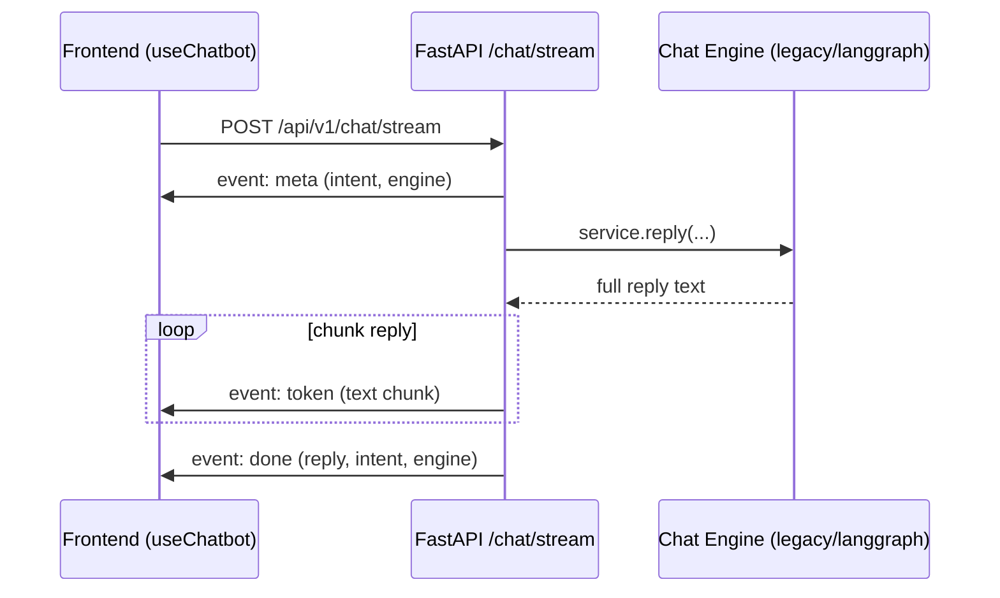

# Chatbot Streaming (Phase 8)

This note captures the additive streaming architecture introduced in Phase 8.

## Contract strategy

- Keep existing `POST /api/v1/chat` unchanged (non-stream JSON response).
- Add new `POST /api/v1/chat/stream` for SSE token streaming.

This preserves backwards compatibility while enabling better chat UX.

## SSE event model

## Frontend behavior

1. Send user message.
2. Open stream request.
3. Append assistant message progressively on `token` events.
4. Finalize on `done`.
5. If stream endpoint returns 404, fallback to `POST /api/v1/chat`.

## Failure behavior

- API emits `error` event on unexpected exceptions.
- Frontend converts stream/network errors into existing chatbot error bubble UX.

## Related files

- `backend/src/api/chat_routes.py`
- `frontend/src/hooks/useChatbot.ts`
- `backend/tests/test_chat_routes.py`
