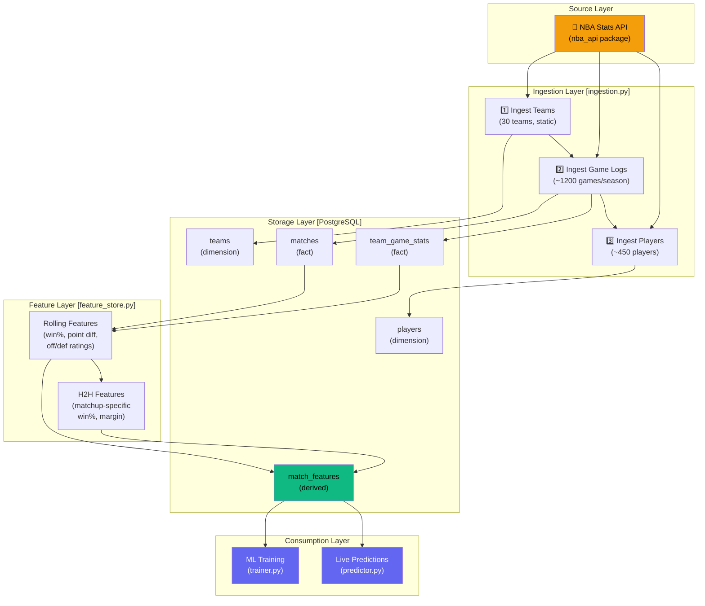
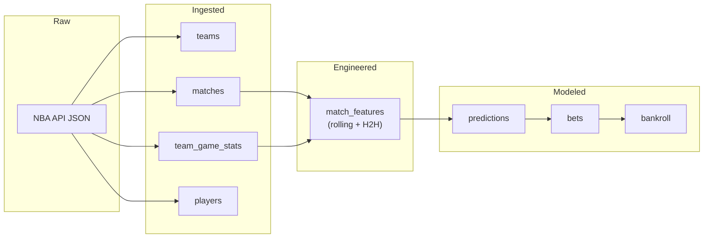

# Data Pipeline Architecture

## Overview

This document details the data pipeline that powers the Sports Analytics Intelligence Platform — from raw NBA API calls to ML-ready features stored in PostgreSQL.

## Pipeline Architecture Diagram



## Pipeline Execution Order

```
┌────────────────────────────────────────────────────────┐
│                    DAILY PIPELINE                       │
│                    Scheduled: 8 AM                      │
├────────────────────────────────────────────────────────┤
│                                                        │
│  Step 1: INGESTION (ingestion.py)                      │
│  ├── 1a. ingest_teams()          →  teams table        │
│  ├── 1b. ingest_season_games()   →  matches +          │
│  │                                  team_game_stats    │
│  └── 1c. ingest_players()        →  players table      │
│                                                        │
│  Step 2: FEATURE ENGINEERING (feature_store.py)        │
│  ├── 2a. compute_features()      →  match_features     │
│  │    (rolling win%, point diff,     (rolling stats)   │
│  │     off/def ratings, rest days)                     │
│  └── 2b. compute_h2h_features()  →  match_features     │
│       (head-to-head win%, margin)    (h2h columns)     │
│                                                        │
│  Step 3: MODEL UPDATE (Phase 2 — not yet implemented) │
│  └── 3a. retrain if drift detected                     │
│                                                        │
└────────────────────────────────────────────────────────┘
```

## Data Volume Estimates

| Table | Rows per Season | Growth Rate | Storage |
|-------|----------------|-------------|---------|
| `teams` | 30 | Static (≈0/day) | < 1 KB |
| `matches` | ~1,230 | ~5 games/day | ~100 KB |
| `team_game_stats` | ~2,460 (2 per game) | ~10 rows/day | ~250 KB |
| `players` | ~450 | Static per season | ~50 KB |
| `match_features` | ~2,460 | ~10 rows/day | ~300 KB |

**Total**: < 1 MB per season. PostgreSQL handles this trivially.

## Pipeline Properties

| Property | How We Achieve It |
|----------|-------------------|
| **Idempotent** | `ON CONFLICT ... DO UPDATE` — re-running produces same state |
| **Ordered** | Teams → Games → Players (FK dependency order) |
| **Rate-limited** | 1-second delay between NBA API calls |
| **Error-isolated** | Try/except per team — one failure doesn't crash the pipeline |
| **Observable** | Structured logging with timestamps, row counts, elapsed time |
| **Resumable** | Idempotency means you can restart from any point |

## Data Lineage



## Interview Angle

> **If asked "Walk me through your data pipeline":**
> 
> "I built a daily batch ETL pipeline. The ingestion layer pulls NBA data via the official API, deduplicates games (each appears for both teams), and upserts into PostgreSQL using ON CONFLICT to ensure idempotency. The feature layer then computes rolling statistics — win percentages, point differentials, offensive/defensive ratings — using PostgreSQL window functions directly in the database, avoiding expensive data movement into Python. I was very careful to use `ROWS BETWEEN 5 PRECEDING AND 1 PRECEDING` to prevent data leakage — this is the number one mistake in time-series ML feature engineering."
