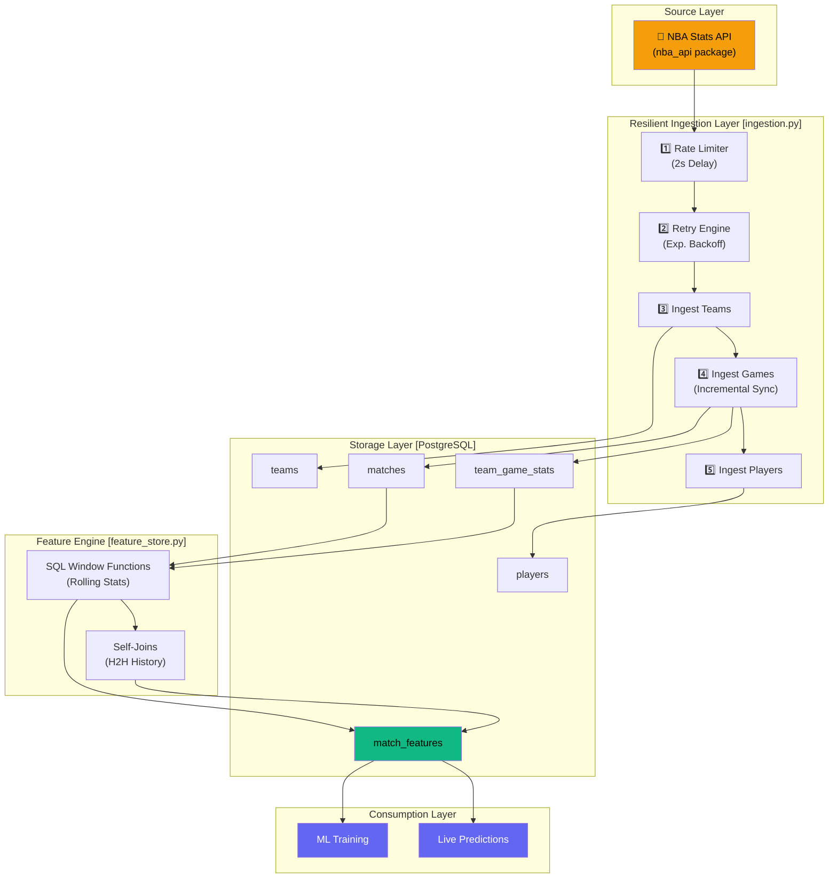
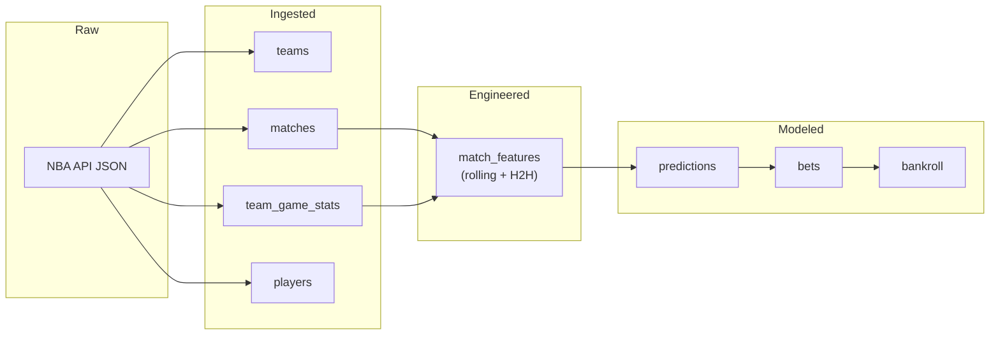

# Data Pipeline Architecture

## Overview

This document details the data pipeline that powers the Sports Analytics Intelligence Platform — from raw NBA API calls to ML-ready features stored in PostgreSQL.

## Pipeline Architecture Diagram



## Pipeline Execution Order

```
┌────────────────────────────────────────────────────────┐
│                    DAILY PIPELINE                       │
│                    Scheduled: 8 AM                      │
├────────────────────────────────────────────────────────┤
│                                                        │
│  Step 1: INGESTION (ingestion.py)                      │
│  ├── 1a. ingest_teams()          →  teams table        │
│  ├── 1b. ingest_season_games()   →  matches +          │
│  │    (Incremental via MAX date)    team_game_stats    │
│  ├── 1c. ingest_players()        →  players table      │
│  └── 1d. audit_data()            →  Quality Report     │
│                                                        │
│  Step 2: FEATURE ENGINEERING (feature_store.py)        │
│  ├── 2a. compute_features()      →  match_features     │
│  │    (In-DB Rolling Stats)                            │
│  └── 2b. compute_h2h_features()  →  match_features     │
│       (Matchup-specific edge)                          │
│                                                        │
│  Step 3: CONSUMPTION                                   │
│  └── 3a. API serves fresh features for tonight's games │
│                                                        │
└────────────────────────────────────────────────────────┘
```

## Resilience Strategy

### 1. Robust API Interactions
The NBA stats API is notoriously flaky and sensitive to scraping. We implement three layers of defense:
- **Centralized Config**: All timeouts and delays are managed in `config.py`.
- **Global Rate Limiting**: Every call is followed by a `REQUEST_DELAY` sleep.
- **Exponential Backoff**: Implementation of a `retry_api_call` decorator that handles transient errors (502, 504, 429) by waiting progressively longer durations before giving up.

### 2. Idempotency (Atomic Upserts)
The pipeline is designed to be **safe to fail**. If the ingestion crashes halfway through, rerunning it will not create duplicate data. We achieve this using PostgreSQL's `INSERT ... ON CONFLICT (id) DO UPDATE` pattern.

### 3. Incremental Watermarking
To minimize the load on the NBA API and our database, we use a **Watermarking Strategy**:
- We query the database for the `MAX(game_date)` of existing records.
- We only request and process games from the API that occurred on or after this date.
- This reduces a full season poll (~1230 games) to a tiny delta (~5-10 games) in daily runs.

## Feature Store Strategy: "Push Compute to Data"

Instead of pulling raw data into Python (Pandas) for feature engineering, we use **PostgreSQL Window Functions**. This follows the "Senior Manager" philosophy of **Pushing Computation to the Data Layer**:

1. **Scalability**: DBs are optimized for relational operations (joins, aggregates).
2. **Efficiency**: Zero data movement overhead.
3. **Consistency**: The same SQL logic produces features for both training and real-time prediction service.

### Anti-Leakage Guardrails
We strictly use `ROWS BETWEEN ... PRECEDING AND 1 PRECEDING` in all window functions. This ensures that a feature record for "Game X" only knows about performance in "Games X-1, X-2...", never "Game X" itself.

## Data Quality & Observability

We implement an `audit_data()` function that runs post-ingestion to check for:
- **Consistency**: Does every completed match have exactly 2 team_game_stats records?
- **Completeness**: Are there any NULL scores in completed games?
- **Health**: Total row count changes compared to historical averages.

## Data Lineage



## Interview Angle

> **If asked "Walk me through your data pipeline":**
> 
> "I built a daily batch ETL pipeline. The ingestion layer pulls NBA data via the official API, deduplicates games (each appears for both teams), and upserts into PostgreSQL using ON CONFLICT to ensure idempotency. The feature layer then computes rolling statistics — win percentages, point differentials, offensive/defensive ratings — using PostgreSQL window functions directly in the database, avoiding expensive data movement into Python. I was very careful to use `ROWS BETWEEN 5 PRECEDING AND 1 PRECEDING` to prevent data leakage — this is the number one mistake in time-series ML feature engineering."
