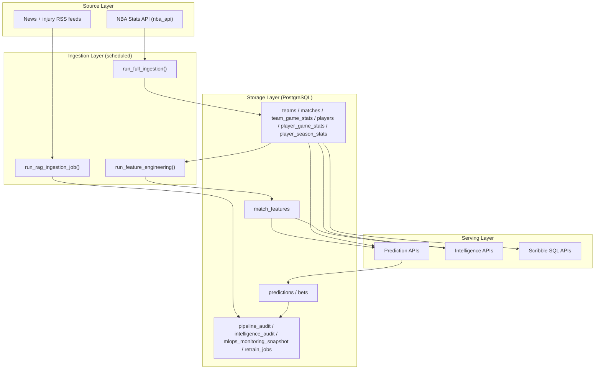

# Data Pipeline Architecture

## Overview

This document captures the live pipeline from source ingestion to feature generation and downstream consumption.

The system uses PostgreSQL as the operational source of truth for:
- raw ingestion data
- engineered match features
- prediction/bet lifecycle outputs
- audit + MLOps monitoring snapshots

## Pipeline Architecture Diagram

```mermaid
flowchart TD
    subgraph "Source Layer"
        API["NBA Stats API (nba_api)"]
        RSS["News + injury RSS feeds"]
    end

    subgraph "Ingestion Layer (scheduled)"
        ING["run_full_ingestion()"]
        FEAT["run_feature_engineering()"]
        RAG["run_rag_ingestion_job()"]
    end

    subgraph "Storage Layer (PostgreSQL)"
        RAW["teams / matches / team_game_stats / players / player_game_stats / player_season_stats"]
        FS["match_features"]
        OPS["predictions / bets"]
        AUDIT["pipeline_audit / intelligence_audit / mlops_monitoring_snapshot / retrain_jobs"]
    end

    subgraph "Serving Layer"
        PRED["Prediction APIs"]
        INTEL["Intelligence APIs"]
        LAB["Scribble SQL APIs"]
    end

    API --> ING
    ING --> RAW
    RAW --> FEAT
    FEAT --> FS

    RSS --> RAG
    RAG --> AUDIT

    FS --> PRED
    RAW --> PRED
    PRED --> OPS
    OPS --> AUDIT

    FS --> INTEL
    RAW --> INTEL
    RAW --> LAB
```

## Scheduler Cadence (Current)

All jobs are started by FastAPI lifespan via APScheduler.

1. `daily_nba_pipeline`
- Runs raw ingestion for configured seasons (`PIPELINE_SEASONS`, default current season only).
- Immediately chains feature engineering after successful ingestion.

2. `daily_feature_engineering`
- Safety-net feature rebuild scheduled after ingestion window.
- Protects against partial failures where chained feature run did not complete.

3. `rag_refresh_<hour>`
- Refreshes intelligence context index at configured UTC hours (`RAG_SCHEDULE_HOURS`).
- Keeps citations and brief outputs fresh for Pulse/Chatbot workflows.

## Pipeline Guarantees

### 1. Idempotent writes
`INSERT ... ON CONFLICT DO UPDATE` is used across ingestion and feature writes, so reruns do not duplicate rows.

### 2. Incremental ingest strategy
The ingestion layer uses watermark-style filtering to avoid full-season reloads during daily runs.

### 3. Non-leaky feature windows
Window features are computed using only prior games (no current-row leakage) for training and serving parity.

### 4. Audit persistence
Each major pipeline path records status/details in audit tables so frontend and operators can inspect freshness and failures.

## Performance Bootstrap Behavior

`GET /api/v1/predictions/performance` supports `bootstrap_if_empty=true`.

When historical prediction rows are missing for completed games:
1. backend scans completed games without prediction rows,
2. computes deterministic feature payloads,
3. persists backfilled predictions,
4. syncs outcomes (`was_correct`) and returns performance summary.

This avoids an empty performance dashboard on new/local environments.

## Interview Angle

"I treat the data pipeline as an operational system, not a script. Ingestion and features are idempotent and scheduled, intelligence refresh runs independently, and every critical step leaves auditable DB evidence that powers monitoring and retrain decisions."
