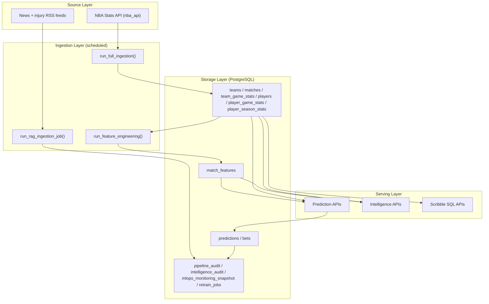

# Data Pipeline Architecture

## Overview

This document captures the live pipeline from source ingestion to feature generation and downstream consumption.

The system uses PostgreSQL as the operational source of truth for:
- raw ingestion data
- engineered match features
- prediction/bet lifecycle outputs
- audit + MLOps monitoring snapshots

## Pipeline Architecture Diagram


```mermaid
flowchart TD
    subgraph "Source Layer"
        API["NBA Stats API (nba_api)"]
        RSS["News + injury RSS feeds"]
    end

    subgraph "Ingestion Layer (scheduled)"
        ING["run_full_ingestion()"]
        FEAT["run_feature_engineering()"]
        RAG["run_rag_ingestion_job()"]
    end

    subgraph "Storage Layer (PostgreSQL)"
        RAW["teams / matches / team_game_stats / players / player_game_stats / player_season_stats"]
        FS["match_features"]
        OPS["predictions / bets"]
        AUDIT["pipeline_audit / intelligence_audit / mlops_monitoring_snapshot / retrain_jobs"]
    end

    subgraph "Serving Layer"
        PRED["Prediction APIs"]
        INTEL["Intelligence APIs"]
        LAB["Scribble SQL APIs"]
    end

    API --> ING
    ING --> RAW
    RAW --> FEAT
    FEAT --> FS

    RSS --> RAG
    RAG --> AUDIT

    FS --> PRED
    RAW --> PRED
    PRED --> OPS
    OPS --> AUDIT

    FS --> INTEL
    RAW --> INTEL
    RAW --> LAB
```

## Scheduler Cadence (Current)

All jobs are started by FastAPI lifespan via APScheduler.

1. `daily_nba_pipeline`
- Runs raw ingestion for configured seasons (`PIPELINE_SEASONS`, default current season only).
- Immediately chains feature engineering after successful ingestion.

2. `daily_feature_engineering`
- Safety-net feature rebuild scheduled after ingestion window.
- Protects against partial failures where chained feature run did not complete.

3. `rag_refresh_<hour>`
- Refreshes intelligence context index at configured UTC hours (`RAG_SCHEDULE_HOURS`).
- Keeps citations and brief outputs fresh for Pulse/Chatbot workflows.

## Airflow Orchestration (Local API Trigger)

For local-laptop orchestration, Airflow can trigger the backend directly via admin API routes:

1. `POST /api/v1/admin/pipeline/run-now`
- Runs ingestion + feature engineering immediately.
- Optional body: `{ "run_rag_refresh": true }` to chain vector refresh.

2. `POST /api/v1/admin/rag/run-now`
- Runs only the RAG/vector refresh path.

3. `GET /api/v1/system/status`
- Used as post-run observability check.

Reference DAG:
- `infra/airflow/dags/gamethread_local_api_pipeline.py`

Flow:
- Airflow task triggers local FastAPI endpoint.
- FastAPI executes the same ingestion/feature logic.
- Writes land in whichever Postgres instance `DATABASE_URL` points to (including cloud-hosted Postgres/Cloud SQL).
- Airflow captures final pipeline health from `/api/v1/system/status`.

## Cloud Orchestration (Composer-Ready DAG)

For production GCP orchestration, a Composer-compatible DAG calls the Cloud Run backend over HTTPS:

```
Cloud Composer 2 / Local Airflow / CI Runner
    │
    ├─ check_backend_health    →  GET  /api/v1/chat/health (fallback: /healthz)
    ├─ trigger_pipeline        →  POST /api/v1/admin/pipeline/run-now
    ├─ trigger_rag_refresh     →  POST /api/v1/admin/rag/run-now (optional)
    └─ verify_system_status    →  GET  /api/v1/system/status
                                       │
                               Cloud Run (gamethread-api)
                                       │
                               Cloud SQL (PostgreSQL)
```

Reference DAG:
- `infra/airflow/dags/gamethread_cloud_pipeline.py` (Composer-ready)
- `infra/airflow/dags/gamethread_local_api_pipeline.py` (local-only)

Configuration (Airflow Variables or env vars):
| Variable | Purpose |
|---|---|
| `GAMETHREAD_API_BASE_URL` | Cloud Run HTTPS URL |
| `GAMETHREAD_CHAT_API_KEY` | X-API-Key for admin auth (from Secret Manager) |
| `GAMETHREAD_PIPELINE_INCLUDE_RAG` | Enable RAG refresh step |
| `GAMETHREAD_API_TIMEOUT_SECONDS` | Max pipeline wait (default 7200s) |

Deployment docs: `infra/composer/README.md`

## Pipeline Guarantees

### 1. Idempotent writes
`INSERT ... ON CONFLICT DO UPDATE` is used across ingestion and feature writes, so reruns do not duplicate rows.

### 2. Incremental ingest strategy
The ingestion layer uses watermark-style filtering to avoid full-season reloads during daily runs.

### 3. Non-leaky feature windows
Window features are computed using only prior games (no current-row leakage) for training and serving parity.

### 4. Audit persistence
Each major pipeline path records status/details in audit tables so frontend and operators can inspect freshness and failures.

## Performance Bootstrap Behavior

`GET /api/v1/predictions/performance` supports `bootstrap_if_empty=true`.

When historical prediction rows are missing for completed games:
1. backend scans completed games without prediction rows,
2. computes deterministic feature payloads,
3. persists backfilled predictions,
4. syncs outcomes (`was_correct`) and returns performance summary.

This avoids an empty performance dashboard on new/local environments.

## Interview Angle

"I treat the data pipeline as an operational system, not a script. Ingestion and features are idempotent and scheduled, intelligence refresh runs independently, and every critical step leaves auditable DB evidence that powers monitoring and retrain decisions."
