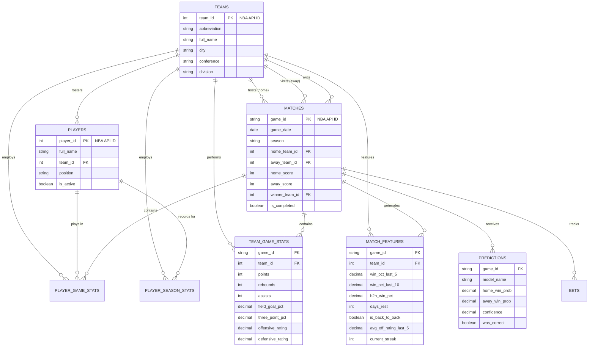

# Database Schema — Sports Analytics Intelligence Platform

## Overview

The platform uses a normalized PostgreSQL 16 schema designed for high-performance time-series feature engineering and concurrent access by the ingestion pipeline and FastAPI prediction engine.

## Schema Diagram (ERD)

## Core Tables

| Table | Purpose | Key Columns |
|-------|---------|-------------|
| `teams` | Dimension table for all NBA franchises. | `team_id`, `abbreviation` |
| `players` | Dimension table for player rosters. | `player_id`, `team_id` |
| `matches` | Fact table for game results and schedules. | `game_id`, `game_date`, `scores` |
| `team_game_stats` | Raw metrics for each team per game. | `points`, `ratings`, `pace` |
| `player_game_stats` | Raw metrics for each player per game. | `minutes`, `fantasy_points` |
| `match_features` | Derived features used as input for ML models. | `win_pct`, `h2h`, `rest` |
| `predictions` | Model output storage for auditing and performance tracking. | `win_prob`, `was_correct` |
| `bets` | Portfolio tracking and bankroll management. | `stake`, `odds`, `pnl` |

## Design Decisions

### 1. Unified Team ID
We use the official **NBA API Team IDs** (e.g., Lakers = 1610612747) as our primary keys or unique identifiers across all tables. This ensures seamless integration with the data source and avoids complex ID mapping.

### 2. Temporal Partitioning Strategy
While we don't use PostgreSQL partitions (not needed for < 1M rows), we use **Indexes on `game_date` and `season`** to optimize the common pattern of querying "last N games" or "current season stats."

### 3. Immutable Raw Data
Tables like `team_game_stats` and `player_game_stats` are considered **immutable** once a game is completed. If we need to change how we represent team quality, we don't change these tables; we update the `match_features` generation logic.

### 4. Precision vs. Storage
- **`DECIMAL(5,3)`** is used for percentages (e.g., 0.456) to ensure exact precision for model training, which float point numbers can occasionally mangle during aggregation.
- **`DECIMAL(8,2)`** for season totals where values can exceed 999.

## Interview Angle

> "I designed the database schema to follow the **Fact-Dimension** pattern common in data warehousing. I used a normalized structure to maintain data integrity, but added critical indexes on `game_date` and `game_id` to ensure that our feature engineering queries — which rely heavily on window functions and self-joins — remain performant as the dataset grows over multiple seasons."
