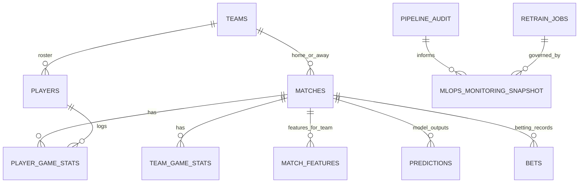

# Database Schema — GameThread

## Overview

GameThread uses PostgreSQL as a combined analytics and operations store.

The schema has four practical groups:
1. **Raw domain data** (teams, matches, player/team stats)
2. **Engineered/model data** (match_features, predictions)
3. **Operations + governance data** (bets, pipeline/intelligence/mlops/retrain audits)
4. **Analyst workspace data** (Scribble notebooks + SQL views)

## High-Level ERD

```mermaid
erDiagram
    TEAMS ||--o{ PLAYERS : roster
    TEAMS ||--o{ MATCHES : home_or_away
    MATCHES ||--o{ TEAM_GAME_STATS : has
    MATCHES ||--o{ PLAYER_GAME_STATS : has
    PLAYERS ||--o{ PLAYER_GAME_STATS : logs

    MATCHES ||--o{ MATCH_FEATURES : features_for_team
    MATCHES ||--o{ PREDICTIONS : model_outputs
    MATCHES ||--o{ BETS : betting_records

    PIPELINE_AUDIT ||--o{ MLOPS_MONITORING_SNAPSHOT : informs
    RETRAIN_JOBS ||--o{ MLOPS_MONITORING_SNAPSHOT : governed_by
```

## Table Groups

### A) Raw data tables
- `teams`
- `players`
- `matches`
- `team_game_stats`
- `player_game_stats`
- `player_season_stats`

Key convention:
- Most tables use `id SERIAL` as internal PK and keep NBA identifiers (`team_id`, `player_id`, `game_id`) as unique/business keys.

### B) Engineered + model tables
- `match_features`
- `predictions`

`match_features` is keyed by `(game_id, team_id)` and stores rolling/H2H/rest/streak signals used in both training and serving.

`predictions` stores model outputs with `UNIQUE (game_id, model_name)` and later gets outcome sync via `was_correct`.

### C) Operations + reliability tables
- `bets`
- `pipeline_audit`
- `intelligence_audit`
- `mlops_monitoring_snapshot`
- `retrain_jobs`

These tables are what turn the project into an operational platform:
- data freshness and job outcomes are inspectable,
- model health trends are persisted,
- retrain lifecycle is tracked with queue/run status.

### D) Analyst workspace tables
- `scribble_notebooks` (auto-created by Scribble routes)
- user-created SQL views in `public` schema

This supports fast analyst iteration without mixing notebook state into feature/model tables.

## Indexing Strategy

Current indexes prioritize:
- time filtering (`matches.game_date`, season-based filters)
- join keys (`game_id`, `team_id`, `player_id` paths)
- operational timeline reads (`mlops_monitoring_snapshot`, `retrain_jobs`)

This balances dashboard responsiveness with ingestion write throughput at current scale.

## Design Notes

1. **Separation of raw vs engineered data**
Raw ingestion tables remain source-faithful while feature logic evolves independently in `match_features`.

2. **Operational provenance over log-only debugging**
Critical runs write structured DB records (`details` JSONB) so the frontend and tests can verify behavior.

3. **Safe reruns by default**
Unique constraints + upsert patterns make daily and manual reruns deterministic.

## Interview Angle

"I designed the schema as an ML operations backbone: raw sports facts, engineered features, persisted model decisions, and explicit audit/retrain governance are all first-class entities in the same Postgres system."
