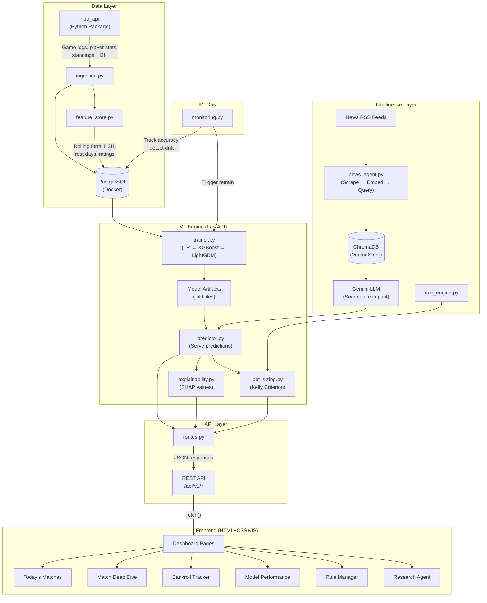

# System Architecture — Sports Analytics Intelligence Platform

## Overview

This platform is a **decoupled ML system** with three distinct layers:

1. **Data Layer** — Ingests sports data, engineers features, stores in PostgreSQL
2. **ML Engine** — Trains and serves predictions via FastAPI REST API
3. **Frontend** — Premium HTML+CSS+JS dashboard that consumes the API

This decoupled architecture (API + Frontend) mirrors how production ML systems work at companies like Uber, Airbnb, and Netflix. The alternative — a monolithic Streamlit app — is faster to build but doesn't demonstrate production-grade system design.

## Architecture Diagram



## Data Flow

```
1. Daily 8 AM: ingestion.py pulls NBA data via nba_api
2. feature_store.py computes rolling features → writes to PostgreSQL
3. trainer.py trains/updates models (if retrain triggered)
4. User opens dashboard → frontend calls /api/v1/predictions/today
5. predictor.py loads model → runs inference → returns predictions
6. explainability.py computes SHAP values → returns feature importance
7. bet_sizing.py applies Kelly Criterion → returns recommended stakes
8. Frontend renders everything with premium visualizations
```

## Key Design Principles

1. **Separation of Concerns**: Each module does one thing well
2. **API-First**: The frontend is just one consumer — you could build a mobile app, Telegram bot, or CLI that uses the same API
3. **Config-Driven**: All parameters live in `settings.yaml`, not hardcoded
4. **Documented Decisions**: Every architectural choice is in `docs/decisions/decision-log.md`
