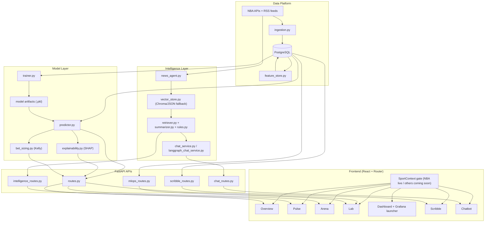

# System Architecture — GameThread

## Overview

GameThread is a production-style sports analytics platform with an API-first backend and a React operations console.

Current live scope:
- Live data path: **Basketball -> NBA**
- Future-ready UI context exists for F1, Tennis, Football, Cricket, but those routes are intentionally gated behind "Coming Soon" states.

Core layers:
1. **Data ingestion + feature store** (PostgreSQL + scheduled Python jobs)
2. **Prediction + explainability engine** (XGBoost/LightGBM/Logistic + SHAP)
3. **Intelligence + chatbot layer** (RAG, LangGraph option, SSE streaming)
4. **API layer** (FastAPI route families for prediction, quality, MLOps, chat, Scribble)
5. **Frontend command center** (React + Vite + TypeScript)
6. **Operations + observability** (audit tables, MLOps snapshots, retrain queue, Langfuse optional)

## Architecture Diagram

```mermaid
graph TB
    subgraph "Data Platform"
        A["NBA APIs + RSS feeds"] --> B["ingestion.py"]
        B --> C[("PostgreSQL")]
        C --> D["feature_store.py"]
        D --> C
    end

    subgraph "Model Layer"
        C --> E["trainer.py"]
        E --> F["model artifacts (.pkl)"]
        C --> G["predictor.py"]
        F --> G
        G --> H["explainability.py (SHAP)"]
        G --> I["bet_sizing.py (Kelly)"]
    end

    subgraph "Intelligence Layer"
        A --> J["news_agent.py"]
        J --> K["vector_store.py (Chroma/JSON fallback)"]
        K --> L["retriever.py + summarizer.py + rules.py"]
        L --> M["chat_service.py / langgraph_chat_service.py"]
    end

    subgraph "FastAPI APIs"
        G --> N["routes.py"]
        H --> N
        I --> N
        L --> O["intelligence_routes.py"]
        M --> P["chat_routes.py"]
        C --> Q["scribble_routes.py"]
        C --> R["mlops_routes.py"]
    end

    subgraph "Frontend (React + Router)"
        S["Overview"]
        T["Pulse"]
        U["Arena"]
        V["Lab"]
        W["Dashboard + Grafana launcher"]
        X["Scribble"]
        Y["Chatbot"]
        Z["SportContext gate (NBA live / others coming soon)"]
        Z --> S
        Z --> T
        Z --> U
        Z --> V
        Z --> W
        Z --> X
        Z --> Y
    end

    N --> S
    N --> U
    N --> V
    O --> T
    R --> V
    Q --> X
    P --> Y
```

## Request Flows That Matter In Interviews

### 1. Arena prediction deep-dive flow
1. Frontend fetches `/api/v1/matches`, `/api/v1/predictions/game/{game_id}`, `/api/v1/features/{game_id}`.
2. Predictor builds model outputs and SHAP explanation.
3. Response is rendered as model confidence + top factor breakdown for one game.

### 2. Pulse intelligence flow
1. Frontend calls `/api/v1/intelligence/brief` and `/api/v1/intelligence/game/{game_id}`.
2. Service refreshes/retrieves context, applies freshness + quality scoring, then deterministic risk overlays.
3. UI renders brief summaries with citation count and risk level.

### 3. Chatbot streaming flow
1. Frontend calls `/api/v1/chat/stream` (SSE).
2. Backend emits `meta`, then incremental `token` events, then `done`.
3. If stream path is unavailable, frontend falls back to `/api/v1/chat` automatically.

## Scheduler and Batch Orchestration

When FastAPI starts, APScheduler jobs are registered:
- `daily_nba_pipeline`: raw ingestion + chained feature engineering (UTC schedule from config)
- `daily_feature_engineering`: safety-net standalone feature rebuild
- `rag_refresh_<hour>`: periodic intelligence index refresh from RSS/injury feeds

Operational state is persisted via:
- `pipeline_audit`
- `intelligence_audit`
- `mlops_monitoring_snapshot`
- `retrain_jobs`

This gives a measurable loop from ingestion freshness -> model quality -> retrain governance.

## Current Design Principles

1. **API-first + thin routes**: route handlers are contracts; core logic lives in service/store modules.
2. **Fail-open optional dependencies**: chatbot and observability degrade gracefully when LLM/Langfuse is unavailable.
3. **Deterministic guardrails around AI**: retrieval quality checks, bounded retries, and explicit fallback behavior.
4. **Incremental rollout for future sports**: UI context is multi-sport, but live paths are explicitly gated to avoid false promises.
5. **Operational traceability**: key jobs and outcomes are queryable, not hidden in logs.

## Interview Framing (2-Minute Version)

"I built GameThread as an API-first sports intelligence platform. A scheduled ingestion and feature pipeline writes into PostgreSQL, prediction services expose model + SHAP outputs, and an intelligence layer adds citation-grounded context with deterministic risk overlays. The React frontend is organized by analyst workflow (Pulse, Arena, Lab, Scribble, Chatbot) with live NBA gating and a clear path for future sports. MLOps snapshots, retrain queue state, and audit tables make the system observable and production-disciplined rather than notebook-only."
