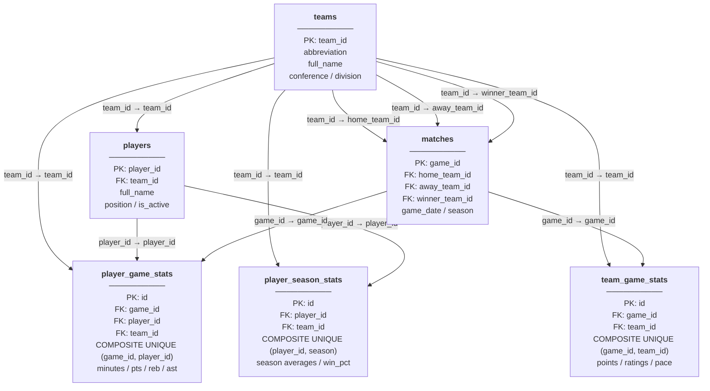
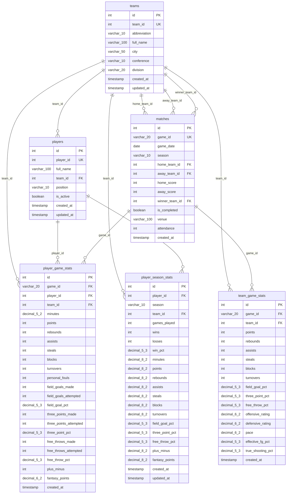

# Raw Tables — DB Diagram Reference

**Platform:** Sports Analytics Intelligence  
**Database:** PostgreSQL 16  
**Scope:** The 6 raw ingestion tables that store NBA data pulled from the NBA Stats API.  
**Source of truth:** `backend/src/data/init.sql`

---

## Table Categories

| Category | Tables | Role |
|---|---|---|
| **Dimension** | `teams`, `players` | Reference/lookup data; anchors all relationships |
| **Fact** | `matches`, `team_game_stats`, `player_game_stats`, `player_season_stats` | Observed event-level and aggregate data |

Dimension tables are written once and updated in-place. Fact tables accumulate new rows as games are played and are considered **immutable** once a game is completed.

---

## High-Level Relationship Overview

A simplified view of how the 6 raw tables connect — table names only, with FK relationship labels.



---

## Full ERD — Raw Tables



---

## Primary Keys

| Table | PK Column | Type | Notes |
|---|---|---|---|
| `teams` | `id` | `SERIAL` | Internal surrogate key |
| `players` | `id` | `SERIAL` | Internal surrogate key |
| `matches` | `id` | `SERIAL` | Internal surrogate key |
| `team_game_stats` | `id` | `SERIAL` | Internal surrogate key |
| `player_game_stats` | `id` | `SERIAL` | Internal surrogate key |
| `player_season_stats` | `id` | `SERIAL` | Internal surrogate key |

> All tables use a `SERIAL` (auto-increment integer) as their surrogate PK. The NBA API's native IDs are stored as separate `UNIQUE` columns (`team_id`, `player_id`, `game_id`) and serve as the **business keys** used in all FK references across the schema.

---

## Unique / Business Keys

| Table | Unique Column(s) | Type | Description |
|---|---|---|---|
| `teams` | `team_id` | `INTEGER UNIQUE NOT NULL` | Official NBA API team ID (e.g. Lakers = 1610612747) |
| `players` | `player_id` | `INTEGER UNIQUE NOT NULL` | Official NBA API player ID |
| `matches` | `game_id` | `VARCHAR(20) UNIQUE NOT NULL` | Official NBA API game ID string |
| `team_game_stats` | `(game_id, team_id)` | Composite `UNIQUE` | One stat row per team per game |
| `player_game_stats` | `(game_id, player_id)` | Composite `UNIQUE` | One stat row per player per game |
| `player_season_stats` | `(player_id, season)` | Composite `UNIQUE` | One aggregate row per player per season |

---

## Foreign Keys — Full Reference

### `players`

| Column | References | Join Condition | Cardinality |
|---|---|---|---|
| `team_id` | `teams.team_id` | `players.team_id = teams.team_id` | Many players → one team |

---

### `matches`

| Column | References | Join Condition | Cardinality | Semantic Role |
|---|---|---|---|---|
| `home_team_id` | `teams.team_id` | `matches.home_team_id = teams.team_id` | Many matches → one team | Home team in this game |
| `away_team_id` | `teams.team_id` | `matches.away_team_id = teams.team_id` | Many matches → one team | Away/visiting team |
| `winner_team_id` | `teams.team_id` | `matches.winner_team_id = teams.team_id` | Many matches → one team | `NULL` when `is_completed = FALSE` |

> `matches` references `teams` **three times** via three separate FK columns. Each FK must be resolved with a separate JOIN alias to get the full context of a game (home name, away name, winner name).

---

### `team_game_stats`

| Column | References | Join Condition | Cardinality |
|---|---|---|---|
| `game_id` | `matches.game_id` | `team_game_stats.game_id = matches.game_id` | Many rows → one game |
| `team_id` | `teams.team_id` | `team_game_stats.team_id = teams.team_id` | Many rows → one team |

---

### `player_game_stats`

| Column | References | Join Condition | Cardinality |
|---|---|---|---|
| `game_id` | `matches.game_id` | `player_game_stats.game_id = matches.game_id` | Many rows → one game |
| `player_id` | `players.player_id` | `player_game_stats.player_id = players.player_id` | Many rows → one player |
| `team_id` | `teams.team_id` | `player_game_stats.team_id = teams.team_id` | Many rows → one team |

> `team_id` is stored redundantly here alongside `player_id` for query performance — it avoids a double join through `players` to get a player's team context for a specific game.

---

### `player_season_stats`

| Column | References | Join Condition | Cardinality |
|---|---|---|---|
| `player_id` | `players.player_id` | `player_season_stats.player_id = players.player_id` | Many rows → one player |
| `team_id` | `teams.team_id` | `player_season_stats.team_id = teams.team_id` | Many rows → one team |

> `team_id` here tracks the player's **last known team** for the season. If a player is traded mid-season, only the final team is stored (NBA API dashboard averages behaviour).

---

## Composite Unique Constraints — Upsert Safety

These constraints enforce data integrity during incremental syncs and prevent duplicate rows from repeated ingestion runs.

```sql
-- team_game_stats: one row per team per game
UNIQUE (game_id, team_id)

-- player_game_stats: one row per player per game
UNIQUE (game_id, player_id)

-- player_season_stats: one row per player per season
UNIQUE (player_id, season)
```

The ingestion pipeline uses `INSERT ... ON CONFLICT DO UPDATE` (upsert) against these constraints to make syncs idempotent — re-running ingestion never creates duplicate rows.

---

## Indexes on Raw Tables

| Index Name | Table | Columns | Query Pattern Optimized |
|---|---|---|---|
| `idx_matches_date` | `matches` | `game_date` | "Last N games" rolling window queries in feature engineering |
| `idx_matches_season` | `matches` | `season` | Season filter on dashboard and API endpoints |
| `idx_team_stats_game` | `team_game_stats` | `game_id` | Fast JOIN from `matches` to per-game team metrics |
| `idx_player_stats_game` | `player_game_stats` | `game_id` | Fast JOIN from `matches` to per-game player metrics |
| `idx_player_season` | `player_season_stats` | `season` | Season aggregate lookups on the Analysis tab |

---

## Common Join Patterns

### 1. Feature Engineering — Rolling Window Per Team

Used by `feature_store.py` to compute rolling win%, point differential, and advanced ratings for a team's last N games before a target match.

```sql
SELECT
    m.game_id,
    m.game_date,
    tgs.team_id,
    tgs.points,
    tgs.offensive_rating,
    tgs.defensive_rating,
    tgs.pace,
    tgs.effective_fg_pct,
    CASE
        WHEN m.winner_team_id = tgs.team_id THEN 1 ELSE 0
    END AS won
FROM team_game_stats tgs
JOIN matches m ON tgs.game_id = m.game_id
WHERE tgs.team_id = :target_team_id
  AND m.game_date < :target_game_date
ORDER BY m.game_date DESC
LIMIT 10;
```

**Tables joined:** `team_game_stats` → `matches`  
**Join key:** `game_id`  
**Purpose:** Feed rolling aggregates into `match_features`

---

### 2. Full Match Context — Home + Away + Winner Names

Used by the API to display human-readable game cards in Today's Predictions.

```sql
SELECT
    m.game_id,
    m.game_date,
    m.season,
    ht.full_name  AS home_team,
    at.full_name  AS away_team,
    wt.full_name  AS winner,
    m.home_score,
    m.away_score,
    m.is_completed
FROM matches m
JOIN teams ht ON m.home_team_id = ht.team_id
JOIN teams at ON m.away_team_id = at.team_id
LEFT JOIN teams wt ON m.winner_team_id = wt.team_id
WHERE m.season = :season
ORDER BY m.game_date DESC;
```

**Tables joined:** `matches` → `teams` (×3 aliases)  
**Join keys:** `home_team_id`, `away_team_id`, `winner_team_id` → `teams.team_id`  
**Why LEFT JOIN for winner:** `winner_team_id` is `NULL` for future/in-progress games

---

### 3. Player Deep Dive — Per-Game Stats with Context

Used by the Analysis tab to display a player's game-by-game performance with team and game metadata.

```sql
SELECT
    p.full_name      AS player_name,
    t.abbreviation   AS team,
    m.game_date,
    m.season,
    pgs.minutes,
    pgs.points,
    pgs.rebounds,
    pgs.assists,
    pgs.plus_minus,
    pgs.fantasy_points
FROM player_game_stats pgs
JOIN players p  ON pgs.player_id = p.player_id
JOIN teams t    ON pgs.team_id   = t.team_id
JOIN matches m  ON pgs.game_id   = m.game_id
WHERE p.player_id = :target_player_id
ORDER BY m.game_date DESC;
```

**Tables joined:** `player_game_stats` → `players` → `teams` → `matches`  
**Join keys:** `player_id`, `team_id`, `game_id`

---

### 4. Season Aggregate — Player Rankings

Used by the Data Quality tab to display top players and by feature engineering for season-level signals.

```sql
SELECT
    p.full_name,
    t.full_name   AS team,
    pss.season,
    pss.games_played,
    pss.points,
    pss.rebounds,
    pss.assists,
    pss.win_pct,
    pss.fantasy_points
FROM player_season_stats pss
JOIN players p ON pss.player_id = p.player_id
JOIN teams t   ON pss.team_id   = t.team_id
WHERE pss.season = :season
ORDER BY pss.points DESC;
```

**Tables joined:** `player_season_stats` → `players` → `teams`  
**Join keys:** `player_id`, `team_id`

---

## Relationship Summary

```
teams (root dimension — no outbound FKs)
  │
  ├──► players.team_id                 (current team assignment)
  │
  ├──► matches.home_team_id            (which team plays at home)
  ├──► matches.away_team_id            (which team is visiting)
  ├──► matches.winner_team_id          (NULL until game completes)
  │         │
  │         ├──► team_game_stats.game_id    (per-game team metrics)
  │         ├──► player_game_stats.game_id  (per-game player metrics)
  │         └──► [match_features.game_id]   (derived — see ml-tables-diagram.md)
  │
  ├──► team_game_stats.team_id         (which team these stats belong to)
  ├──► player_game_stats.team_id       (redundant for query performance)
  └──► player_season_stats.team_id     (last known team this season)

players (player dimension)
  ├──► player_game_stats.player_id     (per-game player metrics)
  └──► player_season_stats.player_id   (season aggregate metrics)
```

---

## Data Type Precision Notes

| Pattern | Used For | Reason |
|---|---|---|
| `DECIMAL(5,3)` | Shooting percentages (FG%, 3P%, FT%, eFG%) | Exact precision; values like `0.456` — float can mangle aggregations |
| `DECIMAL(6,2)` | Ratings and pace (offensive_rating, pace) | Values can exceed 100 (e.g. pace = 102.5) |
| `DECIMAL(8,2)` | Season aggregates (total minutes, totals) | Values can exceed 999 over a full season |
| `DECIMAL(5,2)` | Per-game minutes | Up to 48.00 minutes per game |
| `VARCHAR(20)` | `game_id` | NBA API game IDs are string codes (e.g. `0022401001`) |
| `VARCHAR(10)` | `season` | Stored as `'2025-26'` format |

---

## Next Reference Files

| File | Tables Covered |
|---|---|
| `docs/db-reference/ml-tables-diagram.md` | `match_features`, `predictions`, `bets` |
| `docs/db-reference/mlops-tables-diagram.md` | `pipeline_audit`, `intelligence_audit`, `mlops_monitoring_snapshot`, `retrain_jobs` |
